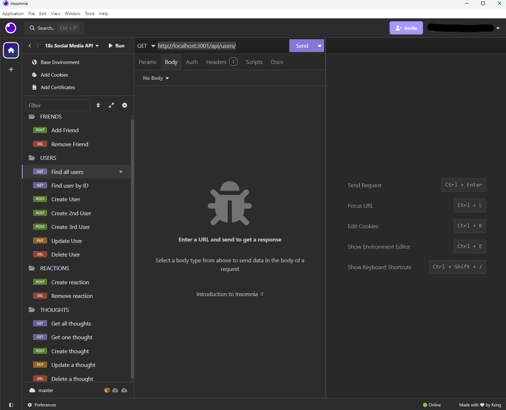

# 18c-Social-Media-API

## Table Of Contents

- [Description](#description)
- [Technologies Used](#technologiesused)
- [Installation](#installation)
- [Usage](#usage)
- [Credits](#credits)
- [License](#license)

## Description

Social networking has become ubiquitous in the last 20 years. Websites like Facebook, LinkedIn, and Instagram allow people from all over the world to connect to discuss hobbies, social issues, and apply for new jobs. The foundation of these applications is data, and building an API that can handle large amounts of unstructured data is critical.

Using Express.js, MongoDB, and Mongoose ODM, I created this API to be used with a social network web application. Users can share their thoughts, react to thoughts, and create a friend list, as well as other CRUD operations. 

## Technologies Used

-- Node.js
-- Express.js
-- MongoDB
-- Mongoose ODM
-- JavaScript

## Installation

This API uses Express.js for routing, a MongoDB database to store data, and the Mongoose ODM library (in conjunction with Node.js) to model the data. In order to use the API locally, the user must install Node.js, MongoDB Community Edition (free version), and an API testing tool like Insomnia or Postman. A demo of the API functionality is provided below.

Demo:
https://drive.google.com/file/d/1O8EmZ1PgCMYByNBCIZFaHngfr4CHzKEc/view?usp=sharing

GitHub Repository:
https://github.com/qbres333/18c-Social-Media-API

## Usage

To use the API locally, the user can do the following:
    -- right click on 'server.js' file and open in the terminal
    -- run the following commands sequentially: npm i, npm run seed, npm run dev
    -- In Insomnia/Postman, enter the URL '[localhost:3001](http://localhost:3001/api/users/)' to begin testing the routes!

## Credits

Mongoose Validation:
https://mongoosejs.com/docs/validation.html

Mongoose Getters and Setters:
https://mongoosejs.com/docs/tutorials/getters-setters.html

Mongoose Pull operator (for deletion):
https://www.mongodb.com/docs/manual/reference/operator/update/pull/

JavaScript date formatting with options:
https://developer.mozilla.org/en-US/docs/Web/JavaScript/Reference/Global_Objects/Intl/DateTimeFormat

## License

MIT License - see the LICENSE file for details.